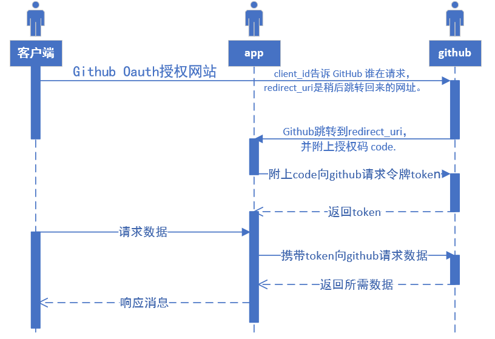
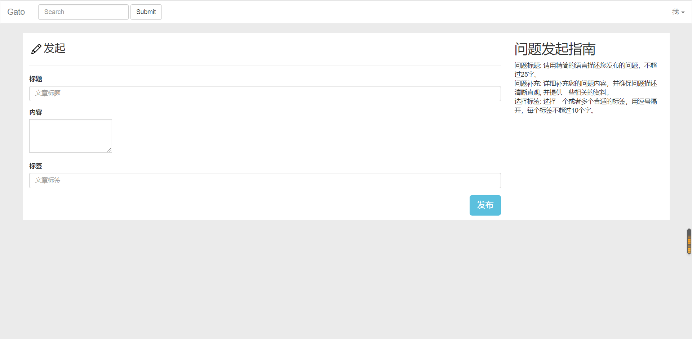
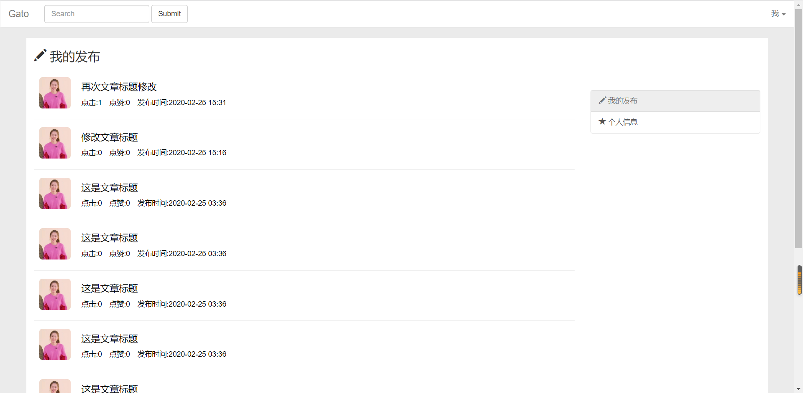
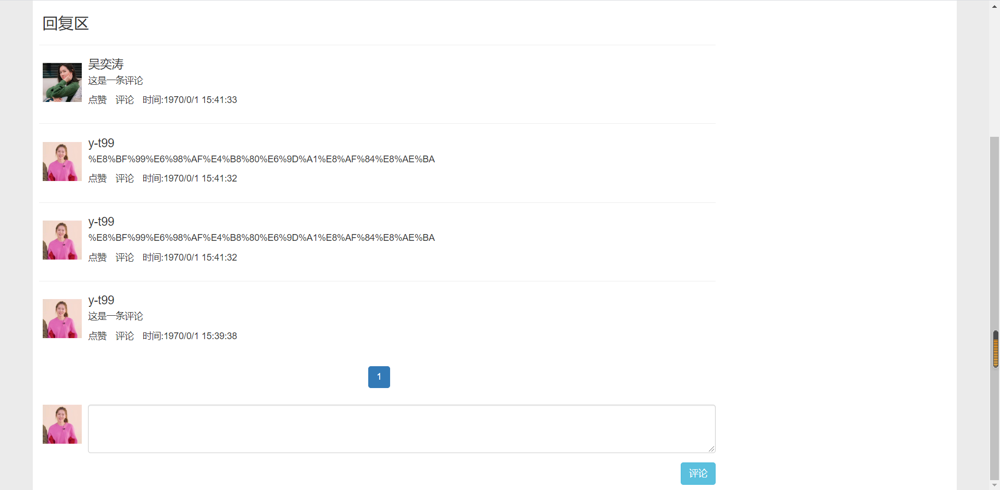
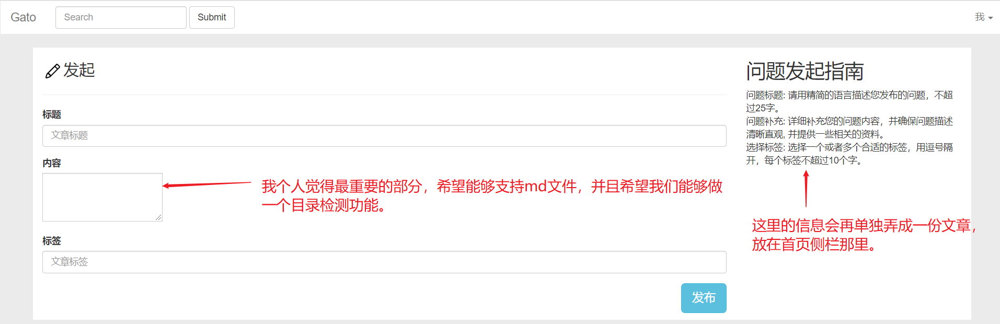
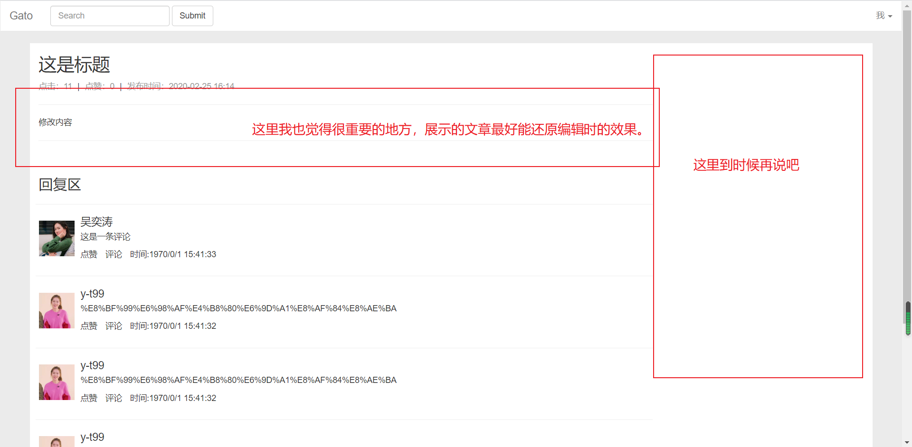
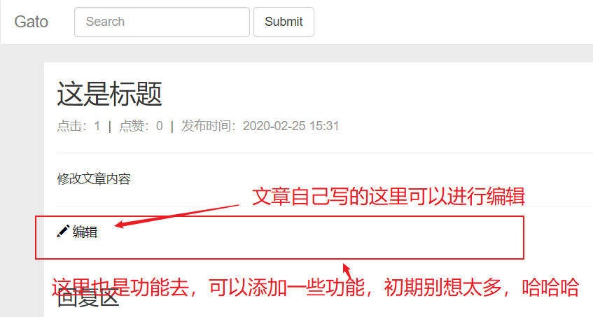
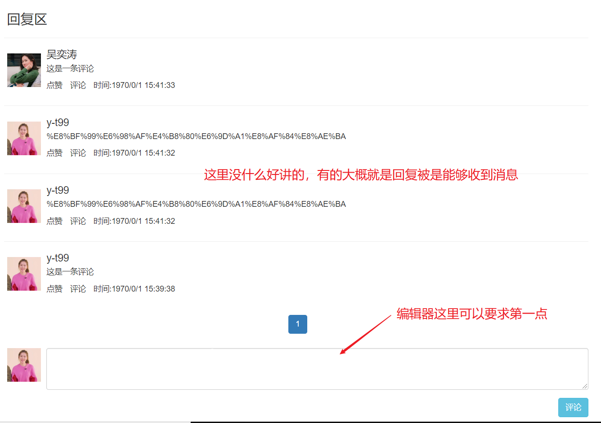

资料

[github oauth](https://github.com/settings/apps/new)

# 一、知识点

## 1、Building OAuth Apps

### 流程

[阮一峰老师的文章](http://www.ruanyifeng.com/blog/2019/04/github-oauth.html)

[官网文章](https://developer.github.com/apps/building-oauth-apps/authorizing-oauth-apps/)

### 时序图



## 2、OKHttp(待学习)

## 3、H2+flyway(待学习)

[文档](http://www.h2database.com/html/quickstart.html)

[学习文章](https://www.cnblogs.com/xuyatao/p/7080095.html)

### H2快速构建


```xml
<dependency>
    <groupId>com.h2database</groupId>
    <artifactId>h2</artifactId>
    <version>1.4.200</version>
</dependency>
```

idea创建嵌入式数据库


# 二、网站设计

## 1、用户信息

### ①确保用户免二次登录的拦截器


### ②登录后用户信息保存流程


## 2、文章访问量统计

### ①博客文章

[Web并发页面访问量统计实现](https://cloud.tencent.com/developer/article/1042709)

### ②我的项目思路

进行较为简单处理：

ⅰ、`Service`类维护一个`HashSet<Pair>`，有`increCount`方法。

ⅱ、`Pair<String,Long>`为客户端IP地址和文章id号。

ⅲ、每次文章浏览量增加前进行查看`HashSet`中是否有`Pair`。

## 3、分页实现

### ①分页实体类

```java
@Data
public class PageDTO<T> {
    /**页码*/
    private List<Integer> pages;
    /**是否有前一页*/
    private Boolean isPrevious;
    /**是否有后一页*/
    private Boolean isAfter;
    /**总记录数*/
    private Integer totalRows;
    /**总页数*/
    private Integer totalPage;
    /**每页固定记录数*/
    private Integer rows;
    /**当前页*/
    private Integer currentRows;
    /**当前页记录数*/
    private Integer currentPage;
    /**页面对象*/
    private List<T> objs;
    /**分页请求地址*/
    private String path;
	/**回到首页图标*/
    //private boolean isStar;
    /**回到尾页功能*/
    //private boolean isEnd;
    
    /**最大的展示页数*/
    private static final int MAX_PAGES=7;
    /**
     * currentPage，totalPage，推断出
     *  isPrevious，isAfter，pages
     */
    public void finishPage() {

        if (currentPage<=0){
            throw new RuntimeException("当前页不能小于1");
        }

        pages=new ArrayList<>();
        if(totalPage<=7){
            for (int i = 1; i <= totalPage; i++) {
                pages.add(i);
            }
        }else if (1<=currentPage&& currentPage<=4){
            for (int i = 1; i<=MAX_PAGES; i++) {
                pages.add(i);
            }
        }else if (currentPage<=totalPage &&currentPage>=totalPage-3){
            for (int i = totalPage;i>totalPage-MAX_PAGES ; i--) {
                pages.add(i);
            }
            Collections.sort(pages);
        } else {
            for (int i=currentPage-3;i<=currentPage+3;i++){
                pages.add(i);
            }
        }

//        if (pages.contains(1)){
//            isStar=false;
//        }else{
//            isStar=true;
//        }

//        if (pages.contains(totalPage)){
//            isEnd=false;
//        }else{
//            isEnd=true;
//        }

        if(currentPage==1){
            isPrevious=false;
        }else {
            isPrevious=true;
        }
        if (currentPage.equals(totalPage)){
            isAfter=false;
        }else{
            isAfter=true;
        }
    }

}
```

### ②实物图


### ③Thymeleaf代码

```html
<nav id="nav-page" aria-label="Page navigation" class="page-nav">
    <ul class="pagination">
        <li>
            <a th:if="${page.isPrevious}" href="#" th:href="@{/{path}/{rows}/{currentPage}(path=${page.path},rows=${page.rows},currentPage=${page.currentPage-1})}" aria-label="Previous">
                <span aria-hidden="true">&laquo;</span>
            </a>
        </li>
        <li th:each="num : ${page.pages}" th:class="${page.currentPage==num?'active':''}">
            <a href="#" th:href="@{/{path}/{rows}/{num}(path=${page.path},rows=${page.rows},num=${num})}">[[${num}]]</a>
        </li>
        <li>
            <a th:if="${page.isAfter}" href="#" th:href="@{/{path}/{rows}/{currentPage}(path=${page.path},rows=${page.rows},currentPage=${page.currentPage+1})}" aria-label="Next">
                <span aria-hidden="true">&raquo;</span>
            </a>
        </li>
    </ul>
</nav>
```

## 4、异常处理

### ①github地址

[github地址]([https://github.com/y-t99/springboot#%E4%B8%80springboot-%E5%BC%82%E5%B8%B8%E5%A4%84%E7%90%86](https://github.com/y-t99/springboot#一springboot-异常处理))

## 5、数据校验

### ①github地址

[github地址]([https://github.com/y-t99/springboot#%E4%BA%8C%E6%95%B0%E6%8D%AE%E6%A0%A1%E9%AA%8C%E5%AE%9E%E6%88%98](https://github.com/y-t99/springboot#二数据校验实战))

[github地址二]([https://github.com/y-t99/ssm-note#%E4%BA%8Cspring%E6%95%B0%E6%8D%AE%E6%A0%A1%E9%AA%8C](https://github.com/y-t99/ssm-note#二spring数据校验))

# 三、DEMO(部分)

## 总览

 









## 1、首页部分


### 附

分页


未登录


## 2、文章部分

### ①、编辑页




### ②、文章浏览







# 四、计划

先把能文章编辑，浏览，回复这几个功能做好再想其他的。然后做好后，因为愿望是能够上线使用，所以我们要对这几个功能的异常处理，数据合法性、业务逻辑都进行加强，不要随随便便就报错，也不要随随便便被人搞，如通过程序不断像我们数据库写数据，刷点击量等等。